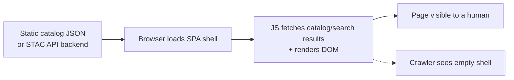
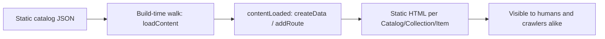

# docusaurus-plugin-stac

[](https://github.com/lowlydba/docusaurus-plugin-stac/actions/workflows/ci.yml)
[](https://docusaurus.io)

A [Docusaurus](https://docusaurus.io) plugin that ingests a static
[STAC](https://stacspec.org) (SpatioTemporal Asset Catalog) and generates **real,
crawlable static HTML pages** for every Catalog, Collection and Item at build time.

Each node gets a server-rendered route with metadata, plus an optional interactive
footprint map - no server, no headless-browser prerendering, no SPA runtime.

This README is organized around the four things you might need:

- **[Tutorial](#tutorial-getting-started)** - install it and generate your first pages.
- **[How-to guides](#how-to-guides)** - accomplish specific tasks (disable maps, swizzle components, run the demo, handle large catalogs).
- **[Reference](#reference)** - plugin and map option tables.
- **[Explanation](#explanation-why-this-exists)** - why this plugin exists and how it works internally.

## Demo

A live demo built from [Overture Maps](https://overturemaps.org)' STAC catalog is
deployed on every merge to `main`:

**https://lowlydba.github.io/docusaurus-plugin-stac/**

Because Overture's collections hold hundreds of Items each, the demo sets
`maxItemsPerCollection` to keep the build bounded - see [Options](#plugin-options).

## Tutorial: getting started

Install the plugin:

```bash
npm install docusaurus-plugin-stac
```

`maplibre-gl` and `pmtiles` ship as dependencies; `@docusaurus/core`, `react` and
`react-dom` are peer dependencies provided by your site.

Add it to `docusaurus.config.js`, pointing `path` at your root STAC catalog or
collection JSON:

```js
// docusaurus.config.js
module.exports = {
  plugins: [
    [
      'docusaurus-plugin-stac',
      {
        // Required: path or URL to the root catalog/collection JSON.
        path: './stac/catalog.json',
        // Optional: base route for all generated pages (default '/stac').
        routeBasePath: '/stac',
        // Optional: map configuration (see below), or `false` to disable maps.
        map: {
          pmtilesUrl:
            'https://overturemaps-extras-us-west-2.s3.us-west-2.amazonaws.com/tiles/2026-05-20.0/base.pmtiles',
          height: 380,
        },
      },
    ],
  ],
};
```

Build your site as usual. The plugin walks the catalog and emits one static route
per Catalog, Collection and Item under `routeBasePath` (default `/stac`) -
open `/stac/index.html` in the build output to see the result.

## How-to guides

### Disable the map

Set `map: false` for users who don't have PMTiles access or don't want to build
them - Item pages then render a text-only bounding-box footprint instead:

```js
['docusaurus-plugin-stac', {path: './stac/catalog.json', map: false}]
```

If `map` is enabled but no `pmtilesUrl` / `style` is given, the map still draws
the Item footprint over a plain background.

### Configure the map

Pass a `map` object (see [map options](#map-options) below) to point at your own
PMTiles archive or MapLibre style, adjust height, attribution, or footprint color.

### Override the rendered pages

The plugin ships swizzle-able theme components you can override in your site:
`StacCatalog`, `StacCollection`, `StacItem`, `StacMap`, and shared bits in
`StacCommon`.

### Handle large or remote catalogs

For remote catalogs with large collections, set `maxItemsPerCollection` to cap
how many Items are rendered as static pages per parent; anything beyond the cap
is deferred to lazy client-side loading via a "Load more" control instead of
bloating the build. Local catalogs are always fully materialized regardless of
the cap. See [Lazy loading of overflow Items](#lazy-loading-of-overflow-items)
for the tradeoffs, and [Plugin options](#plugin-options) for `itemsPerPage` and
`search`.

### Run the example locally

A runnable demo lives in [`example/`](./example):

```bash
npm install          # installs the workspace (root plugin + example)
npm run build        # builds the plugin
npm run build --workspace example   # builds the demo site into example/build
```

Then open `example/build/stac/index.html` (or `npm run serve --workspace example`).

## Reference

### Plugin options

| Option          | Type                          | Default      | Description                                                                 |
| --------------- | ----------------------------- | ------------ | --------------------------------------------------------------------------- |
| `path`          | `string` (**required**)       | -            | Root STAC catalog/collection JSON. Local paths resolve to the site dir; `http(s)` URLs are fetched. |
| `routeBasePath` | `string`                      | `'/stac'`    | Base route all generated pages live under.                                  |
| `id`            | `string`                      | `'default'`  | Instance id for multi-instance use.                                         |
| `title`         | `string`                      | catalog title| Nav/root title override.                                                    |
| `maxDepth`      | `number`                      | `Infinity`   | Max depth to walk from the root (root = 0).                                 |
| `maxItemsPerCollection` | `number`              | `100`        | Max Items per parent rendered as static, crawlable pages. Child/sub-catalog links are always followed. On **remote** catalogs, Items past the cap are deferred to lazy client-side loading (see [below](#lazy-loading-of-overflow-items)) so builds stay bounded; **local** Items are always fully materialized. Set to `Infinity` to disable the cap, or `0` to make every Item lazy. |
| `itemsPerPage`  | `number`                      | `25`         | Page size for paginated child lists (also the lazy load batch size).        |
| `search`        | `boolean`                     | `true`       | Build a client-side search index + search UI.                               |
| `map`           | `object \| false`             | enabled      | Map configuration, or `false` to disable maps entirely.                     |

### Map options

| Option           | Type                          | Default     | Description                                                                            |
| ---------------- | ----------------------------- | ----------- | ------------------------------------------------------------------------------------- |
| `enabled`        | `boolean`                     | `true`      | Master toggle.                                                                         |
| `pmtilesUrl`     | `string`                      | -           | URL to a PMTiles archive read in-browser via range requests. Omit to skip basemap tiles. |
| `style`          | `string \| object`            | -           | A MapLibre style URL or inline style object; takes precedence over the built-in style.   |
| `attribution`    | `string`                      | Overture    | Attribution string for the basemap source.                                            |
| `height`         | `number`                      | `360`       | Map height in CSS pixels.                                                              |
| `footprintColor` | `string`                      | `'#e0114a'` | Color of the footprint outline.                                                        |

### Lazy loading of overflow Items

On **remote** catalogs, any Items beyond `maxItemsPerCollection` for a given parent
are not fetched at build time. Instead the parent page renders a "Load more" control
that fetches those Items in the browser on demand. This keeps builds bounded and fast
while still letting humans browse the full catalog. The tradeoff: lazily loaded Items
are **not** part of the static HTML, so they aren't indexed by crawlers - only the
first `maxItemsPerCollection` Items per parent are guaranteed crawlable. Raise the cap
(or set it to `Infinity`) if you need every Item indexed.

Lazy loading issues in-browser `fetch` requests to the STAC host, so that host must
send permissive CORS headers (`Access-Control-Allow-Origin`). Overture's STAC does.
**Local** catalogs are always fully materialized at build time (the browser can't read
un-served local files), so the cap is effectively a no-op for them.

## Explanation: why this exists

### Motivation

STAC (SpatioTemporal Asset Catalog) was built intentionally as a minimal,
JSON-only wire format. Per the [spec's own README](https://github.com/radiantearth/stac-spec#about),
a STAC catalog can be implemented in a completely "static" manner as a group
of hyperlinked Catalog, Collection, and Item files, letting data publishers
expose their data as a browsable set of files without deploying an API or
database. HTML rendering isn't part of that core spec - it's left to
downstream tooling.

That downstream tool turned out to be [STAC Browser](https://github.com/radiantearth/stac-browser),
a Vue single-page application that renders STAC JSON into an interactive UI.
It's a solid renderer, but being a client-rendered SPA comes with a known
tradeoff: search engine crawlers only see the DOM before JavaScript executes,
so catalog content isn't indexable without an extra pre-rendering step (e.g.
a hosting provider's prerendering pipeline or a headless-browser tool) layered
on afterward, rather than static generation being the default. That's a
meaningful gap given what the spec itself says a Catalog is for: per the
[Catalog spec](https://github.com/radiantearth/stac-spec/blob/master/catalog-spec/catalog-spec.md),
"their purpose is discovery: to be browsed by people or be crawled by clients
to build a searchable index." An SPA that crawlers can't see through works
against that purpose.

That gap remains open today. Meanwhile, per the [STAC API spec's conformance section](https://github.com/radiantearth/stac-api-spec/blob/v1.0.0/api-spec.md#conformance),
the spec aligns with OGC API - Features 1.0 at the JSON/OpenAPI layer, but
doesn't mandate OGC API's own pattern of first-class HTML content negotiation
(`?f=html`) as part of conformance. HTML was always meant to live outside the
spec - this plugin is one way of filling that space for static catalogs.

### What this project does differently

Instead of rendering STAC catalogs client-side in a browser, this plugin walks
a static STAC catalog's `child`/`item` links at build time and generates real
static routes - one per Catalog, Collection, and Item - using Docusaurus's own
static-site-generation pipeline (`loadContent` → `contentLoaded` →
`createData`/`addRoute`).

The result complements SPA-based browsers like STAC Browser: a canonical,
indexable, static HTML page per STAC entity,
with no server, no headless-browser prerendering step, and no SPA runtime
dependency.

**Classic approach (STAC Browser):**



STAC Browser itself ships no server: it's a static client bundle. But it's
commonly pointed at a **STAC API**, a searchable REST backend (frequently
deployed serverless, e.g. [`stac-server`](https://github.com/stac-utils/stac-server)
on AWS Lambda) rather than a plain static catalog. Either way, rendering
happens client-side after the JS shell loads, so the crawlability tradeoff
above still applies.

**This plugin:**



This plugin only targets the static-catalog case (no search API involved);
generation happens once at build time rather than per-request in the browser.

### Map context without a tile server

Basemap previews for STAC data are commonly built on a dedicated raster tile
server (for example [`marblecutter-virtual`](https://github.com/mojodna/marblecutter-virtual)
serving Cloud-Optimized GeoTIFFs on demand). This project instead uses
[Overture Maps' hosted PMTiles](https://docs.overturemaps.org/getting-data/overture-on-aws/) -
static tile archives published to a public S3 bucket with every Overture
release - read directly from the browser via HTTP range requests using
[`pmtiles.js`](https://github.com/protomaps/PMTiles) and MapLibre. No tile
server, no infrastructure to run; it fits the static-site model the same way
the catalog rendering does. This gives every Item page basemap context
(roads, buildings, places) under its footprint/bbox for free. It does not
solve rendering the STAC asset itself (e.g. COG preview) - that's a separate,
deferred problem.

### Prior art considered

- **[STAC Browser](https://github.com/radiantearth/stac-browser)** (Vue SPA) -
  the closest existing tool, but architecturally an SPA with the
  crawlability tradeoff described above.
- **[stacspec.org](https://github.com/radiantearth/stac-spec)** itself - built
  with [11ty](https://www.11ty.dev), but it's a hand-authored docs site, not
  catalog-driven.
- **Generic JSON→static-site tools** (Gatsby, Astro, various SSGs) - none are
  STAC-aware; none understand the Catalog/Collection/Item link structure or
  STAC extensions.

No existing STAC-aware static site generator or Docusaurus plugin was found as
of this writing.

### How it works

1. `loadContent` walks the catalog from `path`, following `child`/`item` links
   into a flattened, route-assigned node tree.
2. `contentLoaded` writes each node's data with `createData` and registers a
   route with `addRoute`, choosing a component by node type.
3. Theme components server-render the metadata; the map mounts client-side
   only (via `BrowserOnly`), keeping the HTML crawlable.

## License

MIT © John McCall
